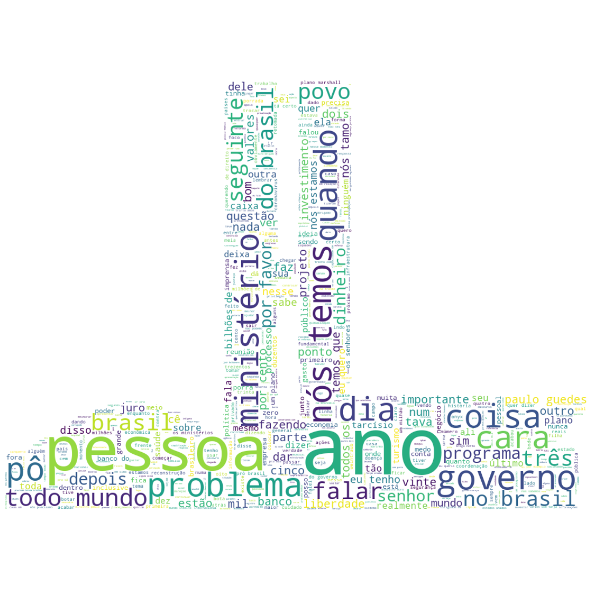

# Nuvem de palavras Reunião Ministerial 22 Abril de 2020

No dia 22 de Abril de 2020 ocorreu a tão falada Reunião Ministerial, hoje estudando Python e agumas de suas bibliotecas, achei que seria interessante juntar esse tema (atual, polêmico, etc...) aos meus estudos e gostaria de compartilhar o resultado.

Utilizei a matéria do  [G1](https://g1.globo.com/politica/noticia/2020/05/22/leia-integra-da-transcricao-do-video-da-reuniao-ministerial-de-22-de-abril-entre-bolsonaro-e-ministros.ghtml) para fazer o web scraping da transcrição da reunião ministerial de 22 de Abril e também uma imagem do site [GratisPNG](https://www.gratispng.com/png-eg7yp6/) do Congresso Nacional.

Utilizando Python e as bibliotecas pandas, numpy, PIL, matplotlib, requests, BeautifulSoup e WordCloud, eis o resultado.

